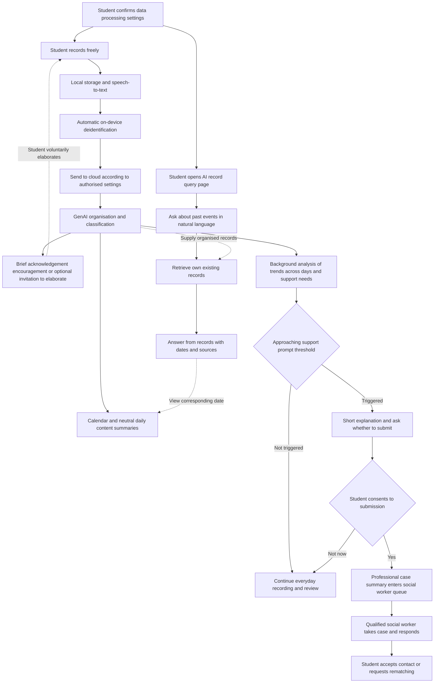

# Project Proposal

*Reviewing private records through a calendar, with AI identifying support needs and offering the option to contact a social worker at an appropriate time*

## Project Overview

Unfold is a private voice diary concept for secondary school and university students in Hong Kong. Students can freely record everyday moments, thoughts, feelings or fragments of conversation without choosing a topic, classifying or organising content, or selecting records for analysis. The main student interface presents a monthly calendar as a timeline of records; tapping a date opens that day's content summary. A separate AI record query page lets students use natural language to ask about and find things they previously recorded. During recording, AI may briefly acknowledge receipt, offer encouragement or occasionally invite students to elaborate on events and their timing. Interaction remains low intensity, and students can leave without responding.

Generative AI (GenAI) automatically integrates authorised records, classifies them by timeline and conversation attributes, and analyses changes across days in the background. The student calendar and daily summaries do not display AI assessments of psychological state. Only when AI judges that the records suggest an approaching threshold for intervention does the system show a support prompt: a short, understandable explanation asking whether the student wants to submit a case to a social worker.

Once the student consents to submission, the system sends a deidentified professional case summary to a restricted social worker case queue. Students do not have to read, classify or edit a complete professional analysis report. Qualified social workers can review the background and send a human response, after which students decide whether to continue contact. Questionnaires, a prototype and professional feedback will be used to evaluate the calendar interface, prompts and handoff process. How the threshold is determined and how effective the service will be remain research questions.

## Project Opportunity and Problem Definition

Some secondary school and university students hesitate to seek help from social workers or counsellors even when experiencing difficulties. They may not know whom to contact, be reluctant to disclose sensitive experiences, or struggle to explain a situation built up from many small events. Between having something to say and being ready to explain it to a professional, students may need to organise their experiences, understand the scope of sharing and build trust. This service aims to support that preparation.

Relevant research suggests that this need warrants attention. A survey of 3,340 Hong Kong residents aged 15–24 found that 16.6% had a probable mental disorder; among this group, 74.1% had not received any services [1]. Another study of 945 university students found that 39.5% had moderate to severe depressive symptoms; only around a quarter of this group had sought professional help [2].

These findings support further research into barriers to student help seeking, but the studies cover different populations and use different measures. They cannot be combined directly to estimate demand for this product. Not accessing services may also reflect time, cost, service availability or other factors. Primary research is therefore needed to establish whether organising and disclosing experiences is an important barrier for the target students, and whether they consider this approach useful.

## Target Users and Use Contexts

The primary users are students who are not yet ready to seek help, want to record experiences privately first, or are preparing to explain their recent situation to a professional. Social workers and counsellors are the other participants in the support process. They need to assess whether summaries provide sufficient background and how much work reading and responding would add.

Secondary school and university students may use the service in different environments. Secondary school students may depend more on school support and lack private recording space, while university students may need to find services on or off campus themselves. These are contexts to investigate. Questionnaire and trial feedback should be analysed separately rather than assuming that both groups have identical needs.

### Hypothetical Use Case

The following fictional scenario illustrates the product flow.

Over two weeks, a university student freely records everyday content: coursework on one day, group task allocation on another, and moments involving meals, interests or conversations with friends. The student need not decide which content is relevant to seeking help or enter academic, interpersonal and emotional topics separately. After a recording, AI might reply, “Received. This entry has been saved.” If the timing is unclear, it may occasionally ask, “If you would like, you can add roughly when this happened.” The student can elaborate or leave without repeated questioning.

When opening the app on an ordinary day, the student sees a monthly calendar. Tapping a date displays a neutral summary such as, “Today you talked about coursework progress, group task allocation and meeting friends.” The interface shows no psychological labels, risk scores or AI inferred emotional ratings. GenAI organises the timeline across entries and analyses related events and changes in the background.

If AI judges that changes in the records are approaching the support prompt threshold, the app displays a short explanation, for example: “You have mentioned difficulties with coursework and group collaboration several times recently, and they have continued for a while. Would you like to submit the relevant background to a social worker so they can contact you?” This is an example of wording, not a claim that this content necessarily meets a defined threshold.

The student can choose to submit or select “Not now.” After consent, the system automatically supplies a case summary for the social worker; the student need not first check a complete analysis report. Once a social worker takes the case and responds, the student can accept contact, request another match or withdraw sharing.

The value to evaluate includes whether free input is convenient, whether the calendar and daily summaries help students recall events, and whether AI prompts appear at an appropriate time with understandable wording that preserves student choice.

## Proposed Solution and Design Rationale

Students can record freely in natural language without completing a fixed questionnaire, assigning categories or selecting material for analysis. The system gives everyday review and background support analysis different purposes. The former lets students view each day's content through the calendar; the latter uses AI to organise context across days, identify changes and decide whether to offer a support prompt.

- Free recording: students can record anything they wish, including fragmented input, mixed topics or events described out of order.
- Brief responses: AI can acknowledge receipt, offer short encouragement or provide an optional invitation to elaborate without requiring an ongoing conversation.
- Calendar review: the main interface displays dates; tapping one shows a neutral daily content summary without an AI psychological assessment.
- Record queries: a separate page lets students ask AI about past events. The system searches their existing records and provides dates and relevant sources with its answer.
- Data processing: original audio and full transcripts stay on the device. The system automatically deidentifies text and transmits it according to authorised settings.
- Background analysis: GenAI automatically organises timelines, conversation attributes and connections across records to support analysis of accumulated changes.
- Timely prompts: when AI judges that the records are approaching a threshold for intervention, it provides a short explanation and asks whether to submit a case to a social worker.
- Consent to submission: only after the student makes this simple choice does the system submit the professional case summary for a social worker to take the case and respond.

Voice input is intended to reduce the effort of recording and support natural expression. Some students may prefer typing or avoid recording because of their surroundings, accent or privacy concerns. Questionnaires and trials will compare input preferences before scheduling later features such as text input for daily records.

Daily summaries for students and case summaries for social workers serve different purposes. The former help students remember what they discussed that day; the latter integrate events across days, relevant context and support cues identified in the background. The student interface need not display full classifications or psychological analysis, and submission does not depend on the student checking every item in a report. Everyday acknowledgement, encouragement and invitations to elaborate are distinct from support prompts triggered by the threshold: everyday responses help with recording, while support prompts offer the choice to submit a case.

## AI Record Query Page

Alongside browsing the calendar by date, students can open a separate AI record query page and use natural language to find past events, much like querying a personal diary database. Students initiate the questions. The purpose is to recall and retrieve recorded content without requiring them to enter or organise their past experiences again.

### Query Method and User Flow

1. The student opens the query page and enters a question, such as “What did I mention about group task allocation last week?”, “When did I mention a coursework deadline?” or “Find my earlier entry about meeting friends.”
2. The system searches records belonging to that student that are available and authorised for processing, using time, topic and content relationships.
3. AI provides a concise answer based on the retrieved records. If several entries are involved, it can arrange relevant passages by date to clarify the sequence of events.
4. The answer includes recording dates and links to the corresponding sources. The student can return to the relevant calendar date to view the daily summary and decide whether to ask further questions.

These questions illustrate how the feature could be used. Actual answers must be grounded in the student's own records. If no relevant content is found, the system says so. Unclear dates or events remain uncertain rather than being filled in with invented memories.

### Relationship with Other Features

The calendar supports browsing by date; the AI query page helps retrieve content by event or topic when the student cannot remember the date. Both use the same personal records, so the query page does not require a second diary. AI responses during recording remain low intensity. Follow-up questions on the query page come from the student, and AI does not independently extend the interaction into a lengthy interview.

Query answers recall only recorded events and the student's own accounts. They do not show background psychological assessments, risk scores or threshold analysis. Making a query does not mean consenting to submit information to a social worker. The handoff continues to follow the support prompt and consent process.

Questions and AI answers must be distinguished from everyday event records. Assumptions in questions and model answers cannot automatically be treated as events the student actually experienced. If a later feature allows additional content to be saved as a record, that action must be clearly labelled so querying does not rewrite existing records.

## Importance, Functions and Advantages of Generative AI

### Importance of AI to the Product

GenAI enables free expression while allowing the system to turn fragmented input into organised context. Requiring students to select records, label categories or reconstruct timelines would place the organising burden back on them. Automatic classification and linking are therefore central to keeping input simple. Brief responses let students know their content has been received and allow them to add context voluntarily when needed. AI interaction is not designed to increase the number of conversational turns or time spent using the app.

AI also analyses accumulated records across days in the background to identify changes that may approach a threshold for intervention. The product aims to offer an easy-to-answer support option at an appropriate time, even before students actively seek help. Students normally use the calendar and daily summaries and may receive brief responses while recording. A short explanation of support needs appears only when a support prompt is triggered.

### Main AI Functions

| Function | System activity | Output and audience |
| --- | --- | --- |
| Low intensity recording responses | Brief acknowledgement, encouragement or occasional invitations to elaborate on events and their timing, without repeated questioning. | Short responses during recording that students can ignore or end. |
| Daily content summaries | Organise the day's events and topics while preserving the original meaning. | Available to students when they tap a calendar date; no AI psychological assessment is added. |
| Personal record queries | Understand natural language questions, retrieve the student's existing records and answer from them. | Concise answers, dates and source links on the separate query page. |
| Timeline organisation | Distinguish recording time from the event time mentioned in the content and mark uncertain dates. | Event timelines for background processing and professional case summaries. |
| Conversation attribute classification | Identify event descriptions, reported feelings, interpersonal interactions, intentions to seek help and ordinary daily content, allowing multiple attributes. | Background analysis data, not psychological ratings for students. |
| Links across records | Connect topics mentioned on different days while retaining additions, corrections and unconfirmed details. | Context for understanding events and changes across days. |
| Identification of support needs | Assess whether content, persistence and changes are approaching the support prompt threshold. | A short explanation and submission option shown to students when prompt conditions are met. |
| Professional case summaries | Integrate timelines, relevant events, reported effects and support cues while retaining sources and uncertainty. | Available to qualified social workers after the student consents to submission. |

“Conversation attributes” describe the nature of expression; “topics” describe subject areas such as coursework, family or relationships. Classification should not assume that every everyday entry indicates a psychological problem. Ordinary daily content should also be preserved as intended. Background analysis and student-visible content need clear boundaries. Analysis must rely on actual student input and distinguish the student's own account from AI generated responses, so encouragement or questions from AI are not treated as evidence of student experiences.

### Expected Advantages over Manual Organisation and Fixed Rules

| Area of comparison | Manual organisation or fixed rules | Expected advantage of the AI design |
| --- | --- | --- |
| Student effort | Students select, label and reorganise records or fit their input into preset fields. | Automatic organisation after free input reduces preparatory work. |
| Expression | Processing relies on predefined fields, keywords and rules. | Natural language and context support varied expression and mixed topics. |
| Context across days | Individual entries or isolated keywords may lack surrounding context. | Connections across entries and changes support prompts and case summaries. |
| Retrieving past events | Users browse day by day or first recall exact keywords. | Natural language queries retrieve personal records with dates and sources for review. |
| Timing of help seeking | Students must recognise the need and decide when to seek help themselves. | AI offers an option when it judges that the support threshold is approaching; students decide whether to submit. |
| Handoff preparation | Students or social workers must reorganise substantial raw content. | Background information is generated automatically for social workers; students only need to choose whether to submit. |

These are expected product advantages, not verified performance claims. Evaluation will compare organising effort, classification and timeline quality, the appropriateness of prompts and professionals' reading burden.

### Support Prompt Threshold and AI Quality

The “threshold” is currently a product planning concept for a support prompt. Its observation scope, criteria, frequency and handling rules still need to be designed with appropriate professionals. It is not presented as an established clinical standard, and the proposal does not guarantee that AI can accurately identify every situation requiring support.

Evaluation must examine false prompts, missed prompts and misunderstandings caused by wording. Short explanations to students should focus on content and changes supported by records, avoiding diagnoses, risk scores or definite conclusions about psychological state. Background analysis and professional summaries must retain sources and uncertainty for social workers' further judgement.

## Examples of Responses and Summaries

The following fictional examples illustrate the different purposes of information for students and social workers.

### Responses During Everyday Recording

| Purpose | Example |
| --- | --- |
| Acknowledgement | “Received. This entry has been saved.” |
| Brief encouragement | “Thank you for recording today's experiences. You can take your time and speak at your own pace.” |
| Optional timing detail | “If you would like, you can add roughly when this happened.” |
| Optional event detail | “If you want to say more, you can add what happened at the time. You can also stop here.” |

These are different responses to use as appropriate, not a set to display together every time. If students do not respond, skip or end the interaction, the system still retains and organises completed records. Invitations to elaborate do not display psychological assessments and are not mandatory steps for generating a summary or submitting a case.

### Daily Summary for Students

After tapping a calendar date, the student might see: “Today you talked about coursework progress, group task allocation and plans to meet friends.” The summary reviews that day's content without adding AI inferred psychological labels, state ratings or risk analysis.

### Short Prompt When Triggered

> You have mentioned difficulties with coursework and group collaboration several times recently, and they have continued for a while. Would you like to submit the relevant background to a social worker so they can contact you?

Students can choose “Submit” or “Not now.” Final wording and trigger conditions require adjustment through research and professional feedback. Students do not have to read or edit the complete case summary first.

### Professional Case Summary for Social Workers

| Field | Example content |
| --- | --- |
| Period covered | Available records from approximately the past two weeks, with recording time and event time marked separately. |
| Relevant events | Coursework submission, group task allocation and interpersonal communication difficulties reported by the student. |
| Timeline and changes | Early entries mainly concern coursework; later entries include more difficulties communicating with group members. |
| Effects reported by the student | The student reports difficulty concentrating on coursework; the extent and causes need clarification from the student. |
| Basis for the prompt | Related difficulties were identified across entries in the background; specific trigger rules remain undecided. |
| Submission status | The student accepted this prompt and consented to submitting case information. |
| Uncertainty | Some event dates were not provided; records do not represent all of the student's experiences. |

Professional summaries are provided to qualified social workers only after student consent to submission. This table is not displayed to students as a psychological report, and they need not approve each item. Original audio and full transcripts are not included in the submission to social workers.

## Student and Social Worker User Flow

### Low Intensity AI Responses During Recording

Students control the pace of input. After listening or receiving an entry, AI may briefly acknowledge it or offer simple encouragement. If an event's timing or sequence is unclear, AI may occasionally offer an open, easily skipped invitation to elaborate. The purpose is to understand the event the student wants to record, rather than require a series of psychological interview questions.

The system does not frequently interrupt students, ask repeated questions or urge a reply when they do not respond. Students can continue, change topics or end the recording; recording and background organisation do not depend on answering AI. The main interface remains centred on the calendar and daily summaries, and low intensity interaction does not turn the diary into prolonged chat.

### Student-Initiated Queries about Past Records

Students can use the separate AI record query page to ask about things they previously discussed or experienced. AI retrieves their existing personal records and answers with dates and sources. Students can return to the calendar to view the corresponding daily summary. This flow is for personal review only; it does not show psychological analysis or trigger case submission.

### Calendar Review and Support Prompts

On first use, students learn about data storage, cloud organisation and background analysis, then confirm data processing settings. Once enabled, they simply record freely while the system automatically handles deidentification, classification and organisation.

The everyday main interface is a monthly calendar timeline, where students tap dates to view daily content summaries. AI analysis of psychological state and trends across days remains in the background and is not displayed on the calendar as scores, labels or ratings.

When AI judges that the support prompt threshold is approaching, the system provides a short explanation and asks whether to submit. Only after consent does it send the professional case summary to social workers. Students who do not submit can continue private recording. Their decision is whether to accept this support submission; reading or editing a complete professional report is not required.

Authorisation for cloud processing and consent to submit to social workers must remain clearly distinguished. Whether new records after submission become part of an accepted case, how students are informed and how withdrawal works remain undecided. The design does not presume that students must reread and approve every summary update.

### Social Worker Case Acceptance and Response

The concept allows qualified social workers to select cases according to expertise, language skills and workload, then send a brief human response through the app. Students can accept and continue the conversation, decline and request another match, or withdraw sharing.

To make this practical, partner organisations must help determine verification of social worker identity, viewing permissions, case allocation and expected response arrangements. Clear handling is also needed when no worker takes a case, a worker leaves or rematching fails. The first prototype can demonstrate the flow with simulated accounts; staffing and response capacity for a live service require separate confirmation.

The withdrawal interface should explain which future access can be stopped and how summaries already stored in the system are handled. Deletion of information already read by professionals or incorporated into organisational records cannot be promised in advance; these conditions must be defined in partnership arrangements.

## Technical and Data Flow

The following is a proposed architecture, not a completed system. On-device speech-to-text is the preferred approach consistent with the existing privacy goals; language support, device performance and accuracy still need evaluation.

| Data type | Proposed processing location | Arrangements to confirm |
| --- | --- | --- |
| Original audio and full transcripts | Student device | Local protection, deletion, backups and handling a lost device. |
| Deidentified text | Automatically processed on the device, then transmitted according to cloud organisation authorisation | Model service retention, deletion and usage restrictions. |
| Daily content summaries | Generated for students to view in the calendar | Faithful review of the day's content without AI psychological analysis. |
| Query questions, retrieved passages and answers | Query feature available to the student personally | Retention and cloud processing remain to be established, following the deidentification principle; questions and AI answers are not event facts. |
| Classifications, event timelines and psychological trend analysis | Restricted background system | Separation from student-visible content; defined purposes, permissions and retention periods. |
| Professional case summaries | Provided to social workers after consent to submission | Submission scope, case access permissions, retention periods and withdrawal flow. |
| Student–social worker messages | Service system supporting communication between both parties | Message access, retention and deletion arrangements to be defined separately. |

Deidentification can reduce exposure but cannot guarantee anonymity. Nicknames, combinations of events, school activities and other indirect information may reveal identity. Evaluation must check both whether identifying details are removed and whether enough context remains for students and social workers to understand the content.

## Relationship with Existing Support Options

| Existing option | Potential student barriers | Intended contribution of this project |
| --- | --- | --- |
| School or university counselling | Students must initiate contact and may struggle to organise experiences for a first meeting. | AI offers support at an appropriate time and automatically supplies a background summary after consent to submission. |
| Helplines | Service availability and a single call may limit follow-up. | Automatically organise context across records to support subsequent human contact. |
| AI mental health chatbots | May misunderstand sensitive situations and cannot replace professional judgement. | AI organises information and identifies support cues; humans conduct support conversations. |
| Ordinary diary or note tools | Save experiences, but students still select and organise content for help seeking. | GenAI organises records automatically; students review a calendar and make a simple submission choice after a prompt. |

These comparisons concern functions and processes; they do not establish superiority over existing options. Further research should examine students' current practices and whether additional organisation and handoff features make using another tool worthwhile.

## Prototype Scope and Safeguards

The first prototype should demonstrate one understandable recording-to-sharing flow: free voice recording, local storage, speech-to-text, automatic deidentification, GenAI timeline and conversation attribute classification, low intensity recording responses, calendar daily summaries, a separate AI record query page, background support need analysis, short prompts and consent to submission, and simulated social worker review and responses. Text input for daily records, additional languages and live institutional integration can be scheduled according to research findings.

AI analysis is limited to records authorised by students, and routine psychological analysis is not displayed in the student interface. The system identifies support cues and offers prompts, but does not diagnose, provide treatment, submit cases to social workers without consent for that submission, or automatically notify schools. Technical evaluation will initially use synthetic cases, and student usability evaluation can use preset scenarios to avoid requiring private experiences. Before using real student data or offering a live support service, partner organisations must confirm applicable consent, safeguarding and support arrangements.

For secondary school contexts, access by different roles, consent and safeguarding processes need particular clarification. Support information and handling arrangements for emergencies must also be reviewed by partner organisations and appropriate professionals. The design will refer to Hong Kong privacy guidance [3]; citing that guidance does not establish that the system meets every requirement.

## User Research and Validation Plan

Student questionnaires are the main primary research method, turning design assumptions into answerable questions. Recruitment channels, sample targets, dates and arrangements for secondary school participation remain for the team to decide. Sensitive questions should be optional, and identifying data unnecessary for the research should not be collected.

| Research question | Proposed information to collect | Design implication |
| --- | --- | --- |
| Where do students encounter barriers to seeking help? | Difficulties finding services, initiating contact and describing experiences. | Decide which part of the process to improve first. |
| How are students willing to record? | Voice and text preferences, use environments and reasons for not using them. | Determine input methods and interface options. |
| Are brief responses helpful? | Whether acknowledgement and encouragement feel natural, and whether invitations to elaborate interrupt or feel compulsory. | Adjust response timing, length and invitation frequency. |
| Do AI queries make records easier to retrieve? | Completion of natural language searches for existing events, and clarity of dates and sources. | Adjust the query page, answer length and source presentation. |
| What information builds trust? | Understanding of local storage, cloud organisation and access permissions. | Revise privacy explanations and confirmation steps. |
| Do students understand support prompts and submission options? | Understanding and acceptance of short explanations, submission scope and social worker access purposes. | Adjust prompt wording and the consent interface. |
| What background do professionals need? | Feedback on summary completeness, reading burden and follow-up questions. | Revise summary structure and the social worker interface. |

Reported willingness in questionnaires needs comparison with actual interaction. Usability evaluation will observe whether students can record freely, skip elaboration invitations and end an entry, find a daily summary in the calendar, retrieve past events through AI queries and check sources, and understand the short explanation, recipient and choices in a triggered prompt. Professionals will assess whether background support cues, timelines and case summaries are supported by evidence and useful.

AI queries also require checks that answers are supported by retrieved records, source dates are correct, and missing records are clearly acknowledged. Technical evaluation will use synthetic cases with known answers to examine transcription errors, missed identifying details, event ordering, conversation attribute classification, links across records, omitted key context and unsupported additions. Cases should include mixed topics, accounts of earlier events and ordinary daily content, checking that everyday material is not incorrectly turned into conclusions about psychological state. Support prompts need evaluation methods developed with professional participation to assess false triggers, missed prompts, timing and wording. Evaluation can compare the time and quality of manual organisation, fixed rule classification and GenAI organisation, but measurement methods and acceptance thresholds must be set before evaluation. Questionnaire and prototype results are not yet available, and short trials cannot establish clinical effectiveness.

## Team and Implementation Plan

The team has four members: two responsible for product design and research, and two for app development. Proposed deliverables for the product and research group are questionnaires, user flows and evaluation feedback. The development group would deliver data flows, an operational prototype and technical evaluation records. Individual responsibilities and schedules remain for the team to confirm.

| Phase | Main deliverables | Completion criteria |
| --- | --- | --- |
| Requirements and research preparation | Questionnaire, research questions and recruitment arrangements | Every core assumption has a corresponding question and analysis method. |
| Flow and summary design | Calendar, daily summaries, AI query page, brief responses, background analysis and submission prompts | Student screens exclude psychological analysis and demonstrate consent, choosing not to submit and rematching. |
| Core prototype | Flow from free recording and automatic classification to simulated social worker responses | No manual selection of analysis records; cases complete calendar review, record queries, background analysis, simulated prompts and consent to submission, with clear transmission and access permissions. |
| Evaluation and revision | Technical evaluation, student trials and professional feedback | Document issues, impacts and revision decisions. |
| Partnership and pilot preparation | Staffing, privacy and support arrangements | Assess a real-world pilot after partner organisations confirm applicable conditions. |

Potential institutional customers include secondary schools, universities and youth service organisations. No paying customers or partners have been confirmed. Adoption also requires assessment of social worker staffing, service responses, cloud usage and maintenance costs. Deliverables at this stage should be a demonstrable prototype and research evidence supporting design decisions, used to determine which elements warrant further development.

## References

[1] HK-YES, Youth Mental Health in Hong Kong: Executive Summary (2019–2022 study, 2023). https://hkyes.hku.hk/_files/ugd/2e2f9b_626b061890704966aef5ee636696e144.pdf?index=true

[2] Sum et al., “Stigma towards mental illness, resilience, and help-seeking behaviours in undergraduate students in Hong Kong,” Early Intervention in Psychiatry (2024). https://pubmed.ncbi.nlm.nih.gov/37438914/

[3] Office of the Privacy Commissioner for Personal Data, Artificial Intelligence: Model Personal Data Protection Framework (2024). https://www.pcpd.org.hk/english/artificial_intelligence/index.html

## User Flow Details Still to Be Determined

The following four design matters remain unresolved. They are listed at the end of the proposal for further discussion and implementation, rather than as established handling rules.

| Unresolved matter | Details to determine |
| --- | --- |
| How the threshold is determined and when prompts appear | Which content and changes across days are analysed, how the observation scope and threshold are set and validated, and when a short support prompt is shown. |
| When to prompt again after the student selects “Not now” | Whether to set a prompt interval, require new changes before another prompt, and how to avoid repeatedly disturbing students. |
| Whether new records after submission automatically update the social worker's case | Which later information is available to the social worker who has taken the case, whether updates are automatic, and related notification, authorisation and withdrawal arrangements. |
| How to handle cases with no social worker, delayed responses or failed rematching | How waiting or failure is shown to students, when and by whom follow-up occurs, and how rematching and other support options are arranged. |
