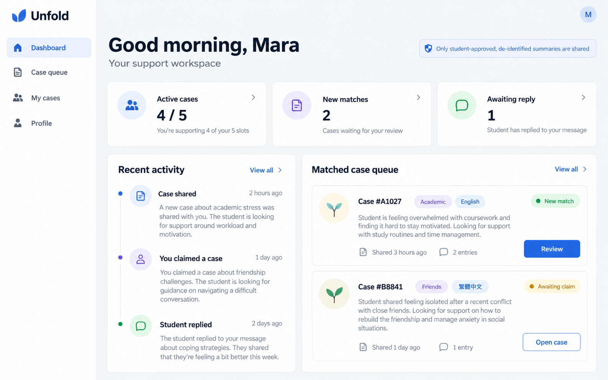
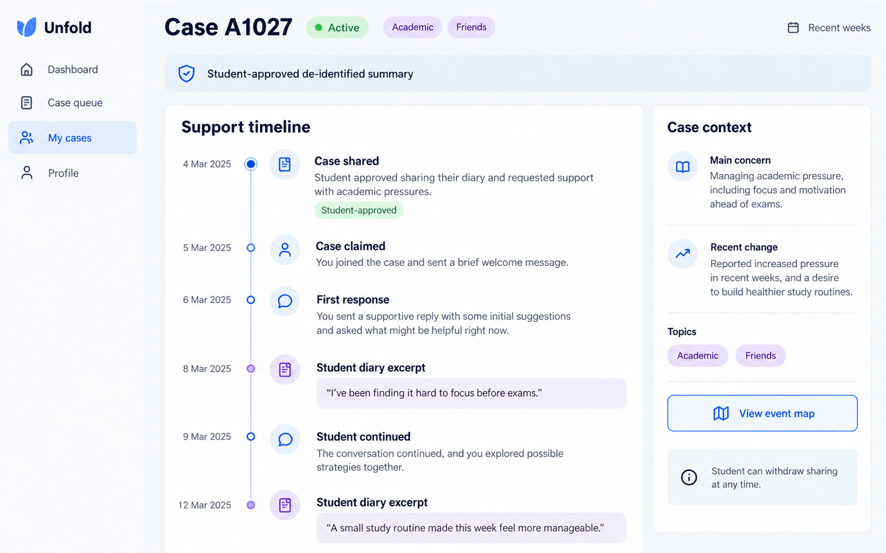
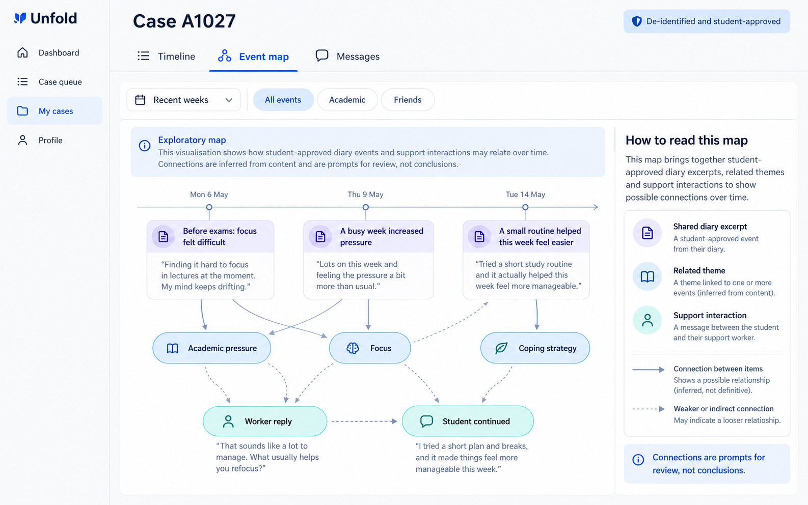
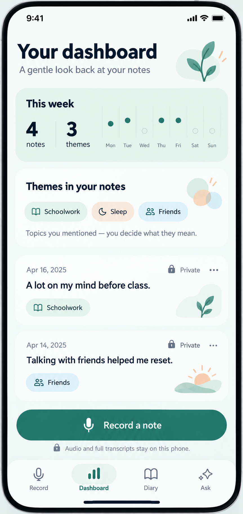
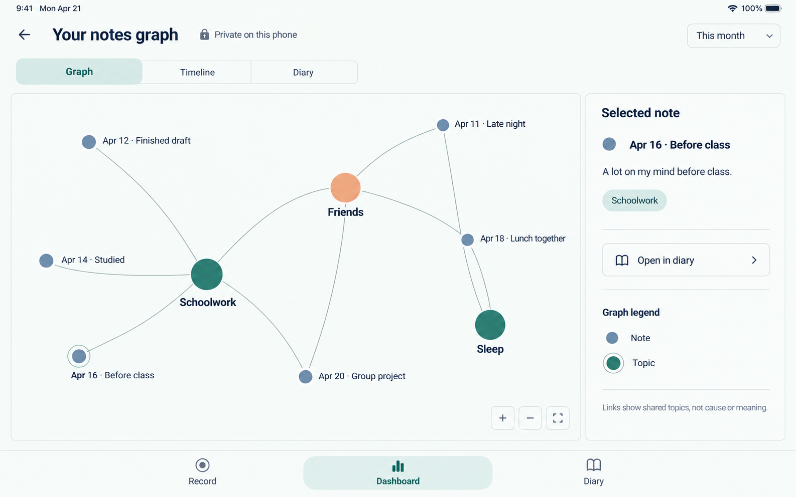
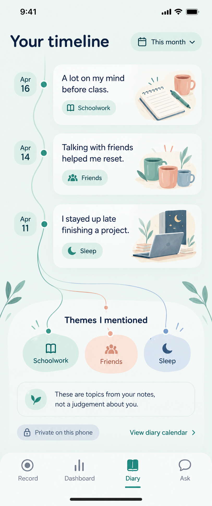

# Unfold Dashboard 示意圖

這組示意圖呈現 Unfold 社工端與學生端 dashboard 的視覺方向。六個對應畫面現已實作；示意圖中的案例、統計數字與日記內容仍為虛構，實際介面改用產品資料且視覺細節可能不同。學生端 Dashboard、Graph 與 Timeline 讀取本機日記資料，不新增網路請求；Graph 的連線只代表共同主題。社工端 Dashboard、個案 Timeline 與 Event Map 使用既有 API，只呈現學生核准分享的去識別個案資料及獲授權訊息；原始錄音與逐字稿不會提供給社工。現有同意與撤回分享邊界維持不變。

1. **社工工作總覽** — 集中查看案件數、待認領案件與近期支援活動。
   

2. **社工個案時間線** — 依時間檢視個案分享、接案、回覆與學生續談等支援節點。
   

3. **社工事件關聯圖** — 將學生核准分享的去識別日記事件、主題與支援互動放在同一張關聯圖中；不是地理地圖。
   

4. **學生 Dashboard** — 回顧本週記錄、日記主題與最近內容，並保留快速錄音入口和隱私提示。
   

5. **學生橫屏事件 Graph** — 以極簡節點網絡呈現日記事件與共同主題 tag，右側顯示選取事件；連線只代表共享主題，不暗示因果。
   

6. **學生日記時間線** — 依日期呈現日記片段，並將主題標籤連到相關記錄；提供較敘事、插畫感的個人回顧視圖。
   
